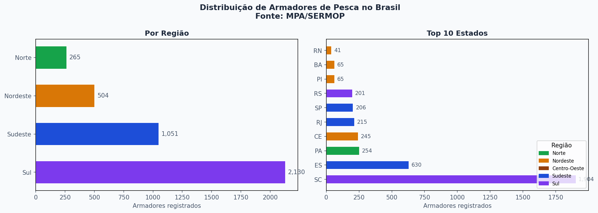

# Relatório

> [!CAUTION]
>
> - Você <ins>**não pode utilizar ferramentas de IA para escrever este relatório**</ins>.

## Identificação

- **Nome**: <mark>`João Pedro Müller Alvarenga`</mark>
- **Cartão UFRGS:** <mark>`577252`</mark>

## Dados utilizados

1. **Dataset 1**: [Registros de Armadores de Pesca — MPA/SERMOP](https://agromapa-my.sharepoint.com/:x:/g/personal/lucas_ramos_mpa_gov_br/ERtMMkNNT1JDtoLNM65A_ZQBfbRer6f3CJUo3GsBfiV9xQ)
    * **Descrição curta**: Cadastro nacional de armadores de pesca (proprietários de embarcações) registrados no Ministério da Pesca e Aquicultura (MPA), contendo dados por município e estado de origem dos registros.

## Código-fonte da visualização

- **Arquivo principal**: 'visualizacao_pescadores.ipynb'
- **Arquivos complementares (se houver)**:  'mapa.html' (saída interativa gerada pelo notebook)
                                            'builder_map'(motor de automação e compilação do projeto)
                                            'template' (o esqueleto da aplicação web que determina sua construção)

## Imagem da visualização gerada

A visualização principal é **interativa** — arquivo `mapa.html`.

**Como acessar:** Baixe o arquivo `mapa.html` deste repositório e abra-o em qualquer navegador moderno (Chrome, Firefox, Edge). Não é necessário servidor ou conexão com a internet.

**Funcionalidades:**
  Clique em qualquer estado para zoom e isolamento geográfico
  Painel lateral com relatório detalhado (Resumo, Temporal, Tipos, Idh, Insights)
  Botão de download do relatório por estado ou região
  Controle de camadas: Heatmap de concentração, Pontos individuais, Rios

## Descrição da visualização

### Legenda (*caption*)

<mark>`Painel interativo que mostra onde estão os donos de barcos de pesca (armadores) no Brasil. O mapa usa cores de "mapa de calor" para destacar as regiões com mais barcos, ficando fácil ver os pontos com maior atividade sobre um fundo escuro que ajuda a focar a atenção. O painel da esquerda muda sozinho quando clicas num estado ou região, mostrando gráficos com a evolução das inscrições ao longo dos anos, se os donos são pessoas físicas ou empresas, e como a pesca se relaciona com a realidade social daquela zona. No topo direito, encontras uma barra de pesquisa para procurar qualquer município rapidamente.`</mark>

### Conclusão demonstrada pela visualização

<mark>`O mapa e os gráficos ajudam a perceber três coisas principais sobre a pesca no Brasil:

    A pesca está muito concentrada: O mapa de calor mostra que os donos de barcos não estão espalhados por igual. Existem "linhas" e manchas muito fortes de atividade na Região Norte (principalmente à volta dos rios do Pará e do Amazonas) e em pontos específicos do litoral Sul e Sudeste. Isto prova que a pesca comercial depende de polos e portos muito específicos.

    A pesca é mais forte onde o IDH é mais baixo: O sistema calcula automaticamente a relação entre o IDH (Índice de Desenvolvimento Humano) e o número de pescadores. A conclusão é que, nos estados com menor IDH, há uma tendência para existirem mais registos de pesca. Isto mostra que a atividade funciona como um sustento essencial e um motor de sobrevivência nas regiões economicamente mais necessitadas.

    A maioria ainda trabalha em nome próprio: Os gráficos de perfil revelam que a grande maioria dos barcos ainda pertence a Pessoas Físicas (cidadãos comuns) e não a grandes empresas (Pessoas Jurídicas). Além disso, o gráfico de linha temporal mostra claramente os anos em que houveram grandes aumentos no número de registos, o que ajuda a perceber quando o governo facilitou a burocracia ou fez campanhas de recadastramento.`
</mark>
